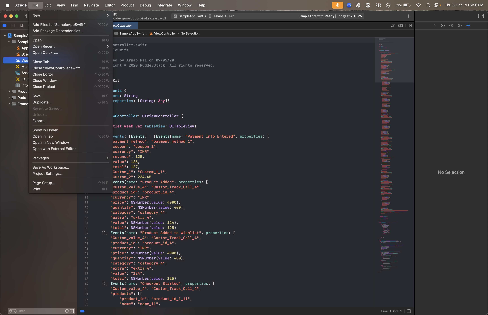
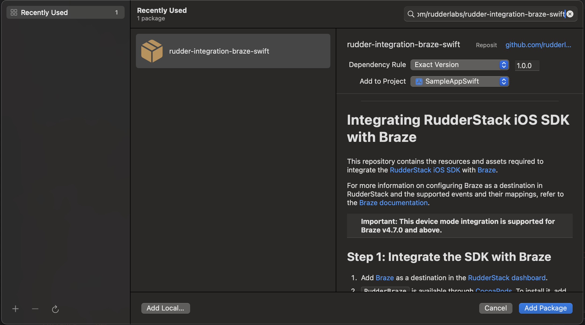

<p align="center">
  <a href="https://rudderstack.com/">
    
  </a>
</p>

<p align="center"><b>The Customer Data Platform for Developers</b></p>

<p align="center">
  <a href="https://cocoapods.org/pods/RudderBraze">
    
    </a>
</p>

<p align="center">
  <b>
    <a href="https://rudderstack.com">Website</a>
    ·
    <a href="https://www.rudderstack.com/docs/destinations/marketing/braze/">Documentation</a>
    ·
    <a href="https://rudderstack.com/join-rudderstack-slack-community">Community Slack</a>
  </b>
</p>

---
# Integrating RudderStack iOS SDK with Braze

This repository contains the resources and assets required to integrate the [RudderStack iOS SDK](https://www.rudderstack.com/docs/stream-sources/rudderstack-sdk-integration-guides/rudderstack-ios-sdk/ios-v2/) with [Braze](https://www.braze.com/).

For more information on configuring Braze as a destination in RudderStack and the supported events and their mappings, refer to the [Braze documentation](https://www.rudderstack.com/docs/destinations/streaming-destinations/braze/).

| Important: This device mode integration is supported for Braze v4.7.0 and above.|
| :---|


## Step 1: Integrate the SDK with Braze

1. Add [Braze](https://www.braze.com/) as a destination in the [RudderStack dashboard](https://app.rudderstack.com/).
2. `RudderBraze` is available through [CocoaPods](https://cocoapods.org) and [Swift Package Manager (SPM)](https://www.swift.org/package-manager/). 

### CocoaPods
Add the following line to your Podfile and followed by `pod install`:

```ruby
pod 'RudderBraze', '~> 1.1.0'
```

### Swift Package Manager (SPM)

You can also add the RudderStack iOS SDK via Swift Package Mangaer.

* Go to **File** -> **Add Package**, as shown:

 

* Enter the package repository (`https://github.com/rudderlabs/rudder-integration-braze-swift`) in the search bar.

*  In **Dependency Rule**, select **Exact Version** and enter latest as the value, as shown:



* Select the project to which you want to add the package.

* Finally, click on **Add Package**.


## Step 2: Import the SDK

### Swift

```swift
import RudderBraze
```

### Objective C

```objectivec
@import RudderBraze;
```

## Step 3: Initialize the RudderStack client (`RSClient`)

Place the following code in your `AppDelegate` file under the `didFinishLaunchingWithOptions` method:

### Objective C

```objective-c
RSConfig *config = [[RSConfig alloc] initWithWriteKey:WRITE_KEY];
[config dataPlaneURL:DATA_PLANE_URL];
[[RSClient sharedInstance] configureWith:config];
[[RSClient sharedInstance] addDestination:[[RudderBrazeDestination alloc] init]];
```
### Swift

```swift
let config: RSConfig = RSConfig(writeKey: WRITE_KEY)
            .dataPlaneURL(DATA_PLANE_URL)
RSClient.sharedInstance().configure(with: config)
RSClient.sharedInstance().addDestination(RudderBrazeDestination())
```
## Step 4: Send events

Follow the steps listed in the [RudderStack iOS SDK](https://github.com/rudderlabs/rudder-sdk-ios/tree/master-v2#sending-events) repo to start sending events to Braze.

### Sending push notification events

To send your push notification events to Braze, follow these steps:

1. Place the following code in your `AppDelegate` file under the `didFinishLaunchingWithOptions` method:

### Objective C

```objective-c
if (floor(NSFoundationVersionNumber) > NSFoundationVersionNumber_iOS_9_x_Max) {
  UNUserNotificationCenter *center = [UNUserNotificationCenter currentNotificationCenter];
  center.delegate = self;
  UNAuthorizationOptions options = UNAuthorizationOptionAlert | UNAuthorizationOptionSound | UNAuthorizationOptionBadge;
  if (@available(iOS 12.0, *)) {
  options = options | UNAuthorizationOptionProvisional;
  }
  [center requestAuthorizationWithOptions:options
                        completionHandler:^(BOOL granted, NSError * _Nullable error) {
      [[RSClient sharedInstance] pushAuthorizationFromUserNotificationCenter:granted];
  }];
  [[UIApplication sharedApplication] registerForRemoteNotifications];
} else {
         UNUserNotificationCenter *center = [UNUserNotificationCenter currentNotificationCenter];
        center.delegate = self;
        [center requestAuthorizationWithOptions:(UNAuthorizationOptionBadge | UNAuthorizationOptionAlert | UNAuthorizationOptionSound)
                              completionHandler:^(BOOL granted, NSError * _Nullable error) {
            if (granted) {
                dispatch_async(dispatch_get_main_queue(), ^{
                    [[UIApplication sharedApplication] registerForRemoteNotifications];
                });
            } else {
                // Handle error or denial
            }
        }];
}
```

### Swift

```swift
if #available(iOS 10, *) {
    let center = UNUserNotificationCenter.current()
    center.delegate = self
    var options: UNAuthorizationOptions = [.alert, .sound, .badge]
    if #available(iOS 12.0, *) {
        options = UNAuthorizationOptions(rawValue: options.rawValue | UNAuthorizationOptions.provisional.rawValue)
        }
        center.requestAuthorization(options: options) { (granted, error) in
            RSClient.sharedInstance().pushAuthorizationFromUserNotificationCenter(granted)
    }
    UIApplication.shared.registerForRemoteNotifications()
} else {
    let types: UIUserNotificationType = [.alert, .badge, .sound]
    let setting: UIUserNotificationSettings = UIUserNotificationSettings(types: types, categories: nil)
    UIApplication.shared.registerUserNotificationSettings(setting)
    UIApplication.shared.registerForRemoteNotifications()
}
```

2. Provide either a `.p8` file (recommended) or a `.p12` certificate push notification file or certificate from Apple. Refer to the [Braze documentation](https://www.braze.com/docs/developer_guide/platform_integration_guides/ios/push_notifications/integration/#step-1-configure-push-notifications) for more details. Implement the following push notification methods:

### Objective C
```objective-c
- (void)application:(UIApplication *)application didRegisterForRemoteNotificationsWithDeviceToken:(NSData *)deviceToken {
    [[RSClient sharedInstance] application:application didRegisterForRemoteNotificationsWithDeviceToken:deviceToken];
}

- (void)application:(UIApplication *)application didReceiveRemoteNotification:(NSDictionary *)userInfo fetchCompletionHandler:(void (^)(UIBackgroundFetchResult))completionHandler {
    [[RSClient sharedInstance] application:application didReceiveRemoteNotification:userInfo fetchCompletionHandler:completionHandler];
}

- (void)userNotificationCenter:(UNUserNotificationCenter *)center didReceiveNotificationResponse:(UNNotificationResponse *)response withCompletionHandler:(void(^)(void))completionHandler {
    [[RSClient sharedInstance] userNotificationCenter:center didReceive:response withCompletionHandler:completionHandler];
}
```

### Swift

```swift
func application(_ application: UIApplication, didRegisterForRemoteNotificationsWithDeviceToken deviceToken: Data) {
    RSClient.sharedInstance().application(application, didRegisterForRemoteNotificationsWithDeviceToken: deviceToken)
}

func application(_ application: UIApplication, didReceiveRemoteNotification userInfo: [AnyHashable: Any], fetchCompletionHandler completionHandler: @escaping (UIBackgroundFetchResult) -> Void) {
    RSClient.sharedInstance().application(application, didReceiveRemoteNotification: userInfo, fetchCompletionHandler: completionHandler)
}

func userNotificationCenter(_ center: UNUserNotificationCenter, didReceive response: UNNotificationResponse, withCompletionHandler completionHandler: @escaping () -> Void) {
    RSClient.sharedInstance().userNotificationCenter(center, didReceive: response, withCompletionHandler: completionHandler)
}
```

## About RudderStack

RudderStack is the **customer data platform** for developers. With RudderStack, you can build and deploy efficient pipelines that collect customer data from every app, website, and SaaS platform, then activate your data in your warehouse, business, and marketing tools.

| Start building a better, warehouse-first CDP that delivers complete, unified data to every part of your customer data stack. Sign up for [RudderStack Cloud](https://app.rudderstack.com/signup?type=freetrial) today. |
| :---|

## Contact us

For queries on configuring or using this integration, start a conversation in our [Slack](https://rudderstack.com/join-rudderstack-slack-community) community.
